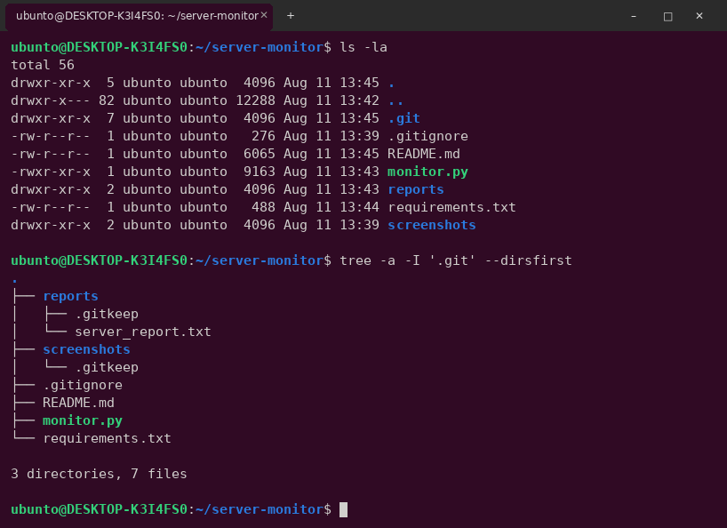
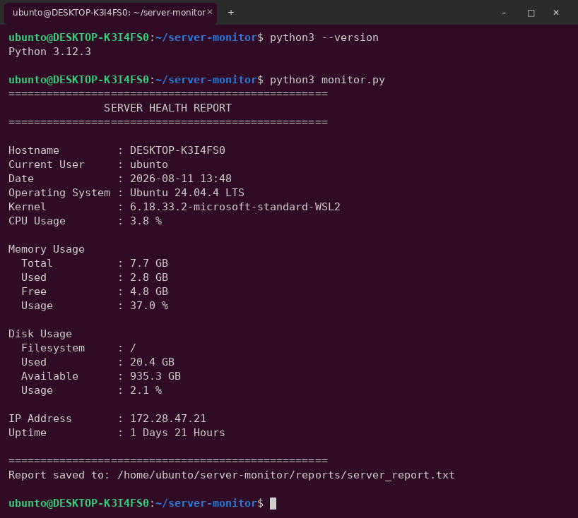
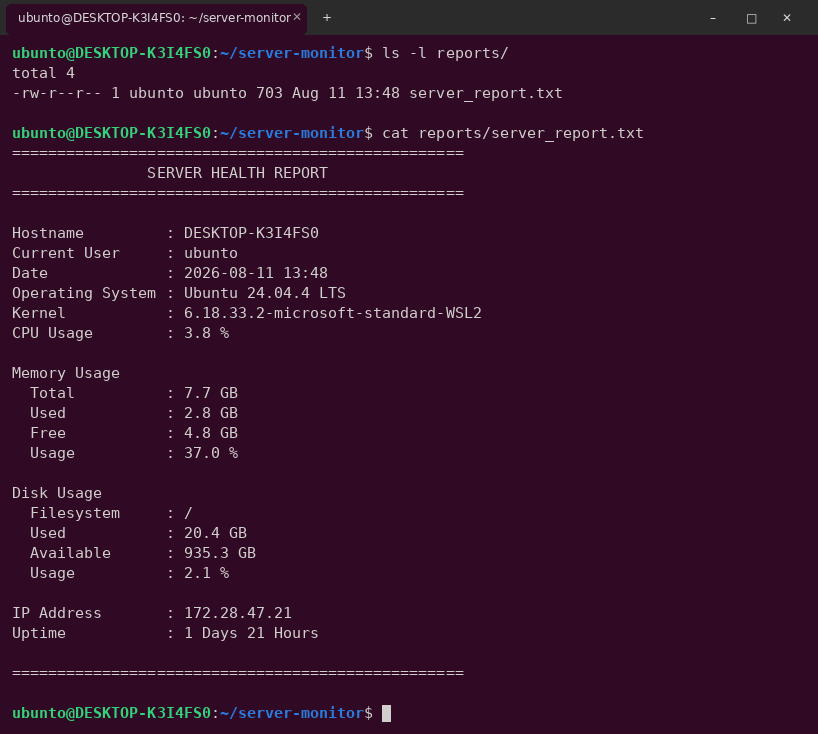
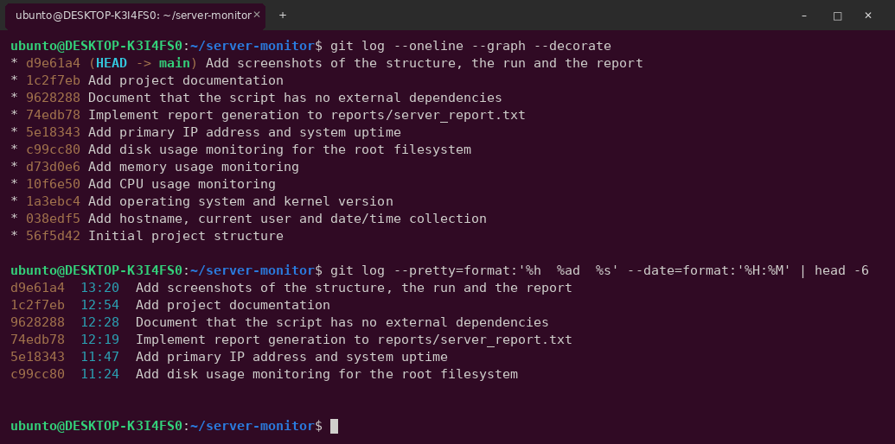
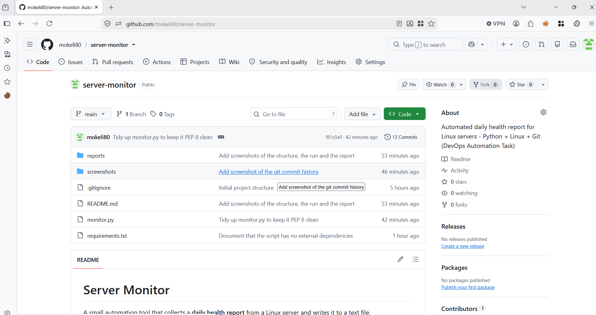

# Server Monitor

A small automation tool that collects a **daily health report** from a Linux
server and writes it to a text file.

---

## Project Description

The Operations team needs a daily health snapshot of every Linux server:
who is logged in, how much CPU and RAM is in use, how full the disk is, which
IP the machine has and how long it has been up.

Collecting this by hand means logging into each server and running `hostname`,
`uname -r`, `top`, `free -h`, `df -h`, `ip a` and `uptime`, then copying the
output somewhere. That is slow and easy to get wrong.

`monitor.py` does the whole thing in one command. It reads the information
directly from the Linux kernel interfaces under `/proc`, prints a formatted
report to the terminal and saves the same report to
`reports/server_report.txt`, ready to be picked up by a scheduled job.

---

## Features

- **Hostname** of the machine
- **Current logged-in user** running the script
- **Date and time** the report was generated
- **Operating system** (distribution name and version)
- **Kernel version**
- **CPU usage** in percent, measured live over a one second interval
- **Memory usage** - total, used, free and usage percentage
- **Disk usage** for `/` - used, available and usage percentage
- **Primary IPv4 address**, correctly selected on hosts with several interfaces
- **System uptime** in days and hours
- **Automatic report generation** to `reports/server_report.txt`
- **No external dependencies** - standard library only
- **Runs from anywhere** - paths are resolved from the script location, so it
  works the same from cron as it does from the shell

---

## Technologies Used

| Technology | Used for |
|---|---|
| **Linux (Ubuntu 24.04 LTS)** | Target platform, project created with shell commands |
| **Python 3** | The automation script |
| **`/proc` filesystem** | Live CPU, memory and uptime data straight from the kernel |
| **Git** | Version control, incremental commits |
| **GitHub** | Public repository hosting |

Python standard library modules used: `os`, `socket`, `platform`, `shutil`,
`getpass`, `time`, `datetime`.

---

## Project Structure

```
server-monitor/
│
├── monitor.py              # The monitoring script
├── reports/
│   └── server_report.txt   # Generated health report
├── screenshots/            # Screenshots of the work
├── README.md               # This file
├── .gitignore              # Ignores __pycache__, venv, editor files
└── requirements.txt        # Documents that there are no dependencies
```

The structure was created with Linux commands:

```bash
mkdir server-monitor
cd server-monitor
mkdir reports screenshots
touch monitor.py README.md .gitignore requirements.txt
```



---

## Installation

You only need Python 3.6 or newer, which is already installed on any modern
Linux distribution.

```bash
# 1. Check that Python 3 is available
python3 --version

# 2. Clone the repository
git clone https://github.com/mokeli80/server-monitor.git
cd server-monitor

# 3. Nothing to install - the script uses the standard library only
pip install -r requirements.txt   # optional, installs nothing
```

---

## How to Run

```bash
python3 monitor.py
```

Or make it executable and run it directly:

```bash
chmod +x monitor.py
./monitor.py
```

Every run prints the report to the terminal **and** overwrites
`reports/server_report.txt` with the latest values.



### Running it daily (optional)

Because the script resolves its own paths, it can be scheduled with cron
without any wrapper:

```bash
# Run every day at 07:00
0 7 * * * /usr/bin/python3 /home/user/server-monitor/monitor.py
```

---

## Sample Output

```
==================================================
               SERVER HEALTH REPORT
==================================================

Hostname         : DESKTOP-K3I4FS0
Current User     : ubunto
Date             : 2026-08-11 13:48
Operating System : Ubuntu 24.04.4 LTS
Kernel           : 6.18.33.2-microsoft-standard-WSL2
CPU Usage        : 3.8 %

Memory Usage
  Total          : 7.7 GB
  Used           : 2.8 GB
  Free           : 4.8 GB
  Usage          : 37.0 %

Disk Usage
  Filesystem     : /
  Used           : 20.4 GB
  Available      : 935.3 GB
  Usage          : 2.1 %

IP Address       : 172.28.47.21
Uptime           : 1 Days 21 Hours

==================================================
```

The generated file:



---

## Notes on the Implementation

A few decisions that are worth explaining:

- **CPU usage is sampled twice.** `/proc/stat` only holds counters since boot,
  so reading it once gives the average since the machine started, not the load
  right now. The script takes two samples one second apart and compares them.
- **Used RAM is `MemTotal - MemAvailable`.** Using `MemFree` would report
  almost all memory as used, because Linux keeps cache and buffers in RAM and
  releases them when an application needs them. The numbers now match
  `free -h`.
- **Disk percentage is calculated as `used / (used + available)`.** That is how
  `df` does it, since a small part of the device is reserved for root. The
  output therefore matches `df -h /`.
- **The primary IP is resolved through a UDP socket.** This host has several
  Docker bridge interfaces, so simply taking the first address from
  `hostname -I` would return the wrong one. Opening a UDP socket towards a
  public address makes the kernel choose the interface with the default route,
  without sending a single packet.

---

## Git History

The project was committed in small steps while it was being built, not as one
big commit at the end.



---

## GitHub Repository

<https://github.com/mokeli80/server-monitor>



---

## Author

**mokeli80**
DevOps Automation Task - Eng. Emad Eldin Adel
